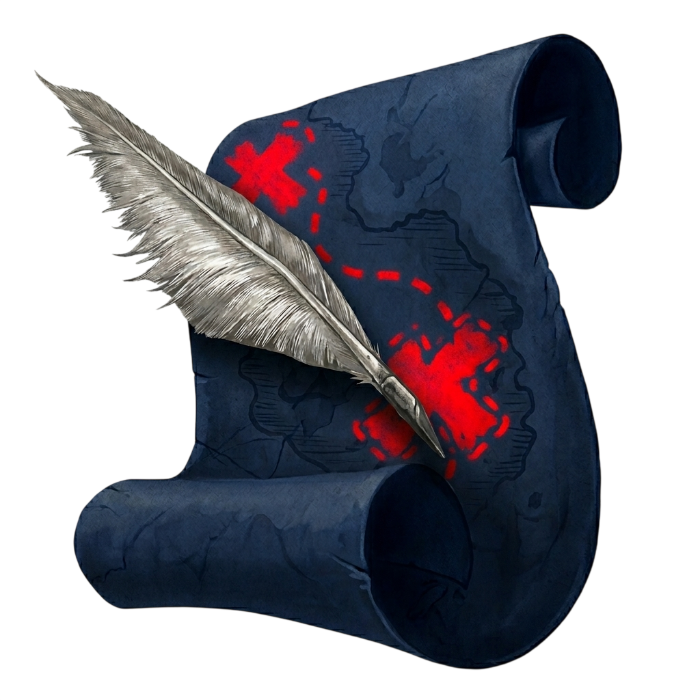
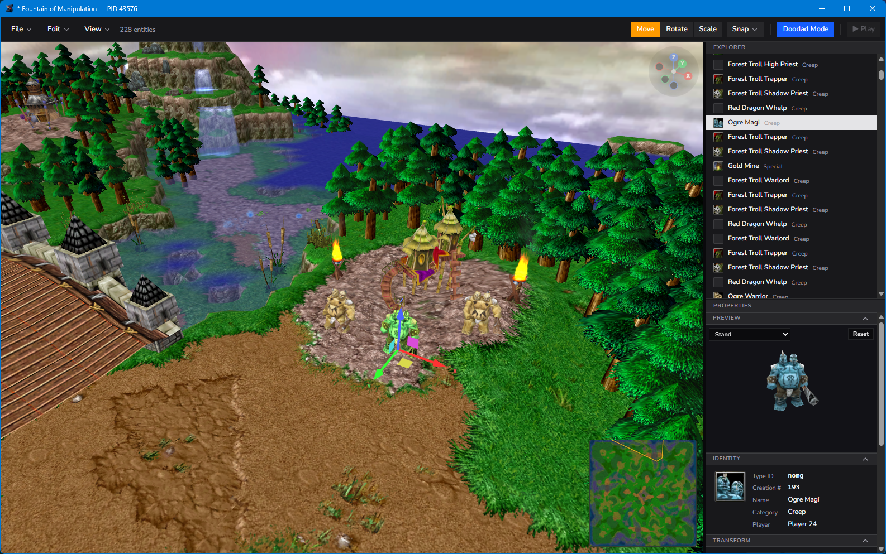

<p align="center">
  
</p>

<h1 align="center">wc3-forge</h1>

<p align="center">
  <i>A Warcraft III map editor designed to be driven by Claude Code as much as by hand.</i>
</p>

<p align="center">
  
</p>

wc3-forge is a native Warcraft III map editor (Go + TypeScript, single [Wails](https://wails.io) binary) with an embedded MCP server. The GUI and Claude Code talk to the same editor session — every edit you make by hand can also be made by an agent, and vice versa, and they share one undo stack.

**Status:** alpha. Read+write across most surfaces, wired through both the GUI and MCP: placed units and doodads (move / rotate / scale, plus create + delete), terrain (tile + height), a full Object Editor for all 7 definition kinds (units, items, abilities, buffs, destructables, doodads, upgrades — read + write custom and stock objects), and a complete Trigger Editor (GUI tree + Monaco code view + WC3 IntelliSense + GUI→Lua/JASS codegen + native JASS-map editing + Convert-Map-to-Lua + Test Map). Older JASS maps open, edit, save, and Test Map directly — no conversion required. Maps save in place, including packaged `.w3x` / MPQ archives. Some rough edges remain.

## Get started with Claude Code

Three steps. Windows is the primary, released platform; macOS is supported via build-from-source (no prebuilt macOS binary, and the in-app updater is Windows-only).

**1. Install wc3-forge.** On Windows, grab a [release](https://github.com/StephenSHorton/wc3-forge/releases) (installer or portable zip) or build from source. On macOS, build from source.

On **Windows** (PowerShell):

```powershell
git clone https://github.com/StephenSHorton/wc3-forge
cd wc3-forge
wails build
```

The binary lands at `build/bin/wc3-forge.exe`.

On **macOS** (one extra step for CascLib):

```bash
git clone https://github.com/StephenSHorton/wc3-forge
cd wc3-forge
./scripts/build-casclib-macos.sh   # one-time: compiles libcasc.dylib into scripts/casclib/
wails build
```

The bundle lands at `build/bin/wc3-forge.app`. CascLib is dlopen'd at
runtime via purego, so the .dylib must sit alongside the binary inside
the .app bundle; the `darwin/*` postBuildHook in `wails.json` copies it
in for you. The dylib is `.gitignore`d — every dev machine builds its own.

The macOS build is arm64 by default (matches the host); cross-build with
`wails build -platform darwin/amd64` after running the casclib script on
a matching arch.

**2. Register the MCP server.** The MCP server is built into the wc3-forge
binary — `--mcp` makes it run as an MCP stdio server (a thin proxy to a running
editor instance). No Node, no extra install: point Claude Code at the same
executable you launch.

On **Windows** (PowerShell), pointing at an installed/built binary:

```powershell
claude mcp add wc3-forge --scope user -- "C:\Program Files\wc3-forge\wc3-forge.exe" --mcp
# or a local build:
claude mcp add wc3-forge --scope user -- "$PWD\build\bin\wc3-forge.exe" --mcp
```

On **macOS**:

```bash
claude mcp add wc3-forge --scope user -- "/Applications/wc3-forge.app/Contents/MacOS/wc3-forge" --mcp
```

(`--scope` must come before `--`; everything after `--` is the command Claude
launches.) Verify with `claude mcp list` — `wc3-forge` should show ✓ Connected.

<details>
<summary>Legacy / dev: the standalone Node server</summary>

The original MCP server still lives in [`mcp/`](mcp/) and is the source of truth
for the tool catalog (the Go `--mcp` mode embeds a catalog generated from it via
`npm run gen:tools`). To run it directly instead of `--mcp`:

```powershell
cd mcp
npm install
npm run build
claude mcp add wc3-forge --scope user -- node "$PWD\dist\index.js"
```

Both servers speak the identical wire protocol and tool set, and discover running
editor instances the same way (per-pid lockfiles), so they're interchangeable.

</details>

**3. Launch wc3-forge and talk to it.** Open the editor (`build/bin/wc3-forge.exe`), load a map (`File → Open Map…`), then in Claude Code:

```
What's the current map?
> map_status → "Fountain of Manipulation", 184 units, 2031 doodads

Move the gold mine at position 0,0 to where the player 1 start location is.
> units_list → finds creation_number 17 (typeid 'ngol' at -512, 384, 0)
> camera_set_view → pans to confirm
> units_move → applied

Save it.
> map_save → ok
```

The **Agent Console** (Ctrl+\` in the editor) streams every bridge call live — `bridge_ping`, `units_move`, `map_save`, durations, params, results. Use it to watch what an agent is doing in real time.

### What Claude can do today

**152 MCP tools** across these surfaces (the [tool reference](https://stephenshorton.github.io/wc3-forge/docs/tool-reference) walks through them by surface):

| Surface | Tools |
|---|---|
| Map lifecycle | `map_open`, `map_close`, `map_status`, `map_save`, `map_new`, `map_save_as`, `map_extract_to_folder` |
| Map info | `map_info_get`, `map_info_set` (name, author, description, suggested players, lua flag; TRIGSTR-aware on localized maps) |
| Placed units | `units_list`, `units_get`, `units_move`, `units_rotate`, `units_scale`, `units_set_field`, `units_create`, `units_delete` |
| Placed doodads | `doodads_list`, `doodads_get`, `doodads_move`, `doodads_rotate`, `doodads_scale`, `doodads_create`, `doodads_delete` |
| Regions | `regions_list`, `regions_get`, `regions_create`, `regions_move`, `regions_resize`, `regions_rename`, `regions_delete` |
| Start locations | `start_locations_list`, `start_locations_create`, `start_locations_move`, `start_locations_delete` |
| Terrain | `terrain_get_tile`, `terrain_set_tile`, `terrain_paint_tile`, `terrain_set_height`, `terrain_brush_height`, `terrain_brush_cliff`, `terrain_brush_ramp`, `terrain_brush_water`, `terrain_swap_tileset` |
| Object definitions (read + write, all 7 kinds) | `objects_<kind>_list`, `objects_<kind>_get`, `objects_<kind>_set_field`, `objects_<kind>_create_custom`, `objects_<kind>_delete_custom`, `objects_<kind>_fields_meta` for `<kind>` in units / items / abilities / buffs / destructables / doodads / upgrades, plus `objects_convert` |
| Gameplay constants | `gameplay_constants_get`, `gameplay_constants_apply` |
| Imports | `imports_list`, `imports_add`, `imports_remove`, `imports_rename` |
| Models / minimap | `models_import` (OBJ/glTF/STL → MDX), `minimap_bake` |
| Triggers | `triggers_tree`, `triggers_get`, `triggers_add_gui`, `triggers_generate_script`, `triggers_convert_to_lua`, `triggers_test_map`, … (full GUI tree + Monaco editor + GUI→Lua/JASS codegen + Convert-Map-to-Lua + Test Map) |
| Selection | `selection_get`, `selection_set`, `selection_clear` |
| View + camera | `view_get_mode`, `view_set_mode`, `view_set_doodad_category_visible`, `camera_set_view` |
| Window | `window_set_title` (label your instance so parallel agents are distinguishable) |
| History | `history_undo`, `history_redo`, `history_list`, `history_begin_group`, `history_end_group`, `history_abort_group` |
| Diagnostics | `diagnostics_get`, `diagnostics_arm` |
| Multi-instance | `sessions_list`, `session_select` (point Claude at one of several running wc3-forges) |

All entity tools speak **game coordinates** (origin at map center, units = WC3 world units). All mutations flow through the same history stack the GUI uses, so `Ctrl+Z` in the editor undoes Claude's edits and vice versa.

### Multi-instance

You can run several wc3-forges at once — the bridge picks an unused port and each writes its own per-pid lockfile at `~/.wc3-forge/mcp/<pid>.lock`. `sessions_list` enumerates them; `session_select` pins subsequent tool calls to one. Use `window_set_title` to label them so parallel agents can tell instances apart at a glance.

## Building

```
wails build
```

`build/bin/wc3-forge.exe` is the output. The `postBuildHooks` entry in `wails.json` copies the vendored CASC DLLs next to the binary so it's self-contained.

## Design

- **Go backend + Svelte / TypeScript frontend** in one Wails binary; frontend bundle embedded via `go:embed`.
- **Two control surfaces, one editor**: the GUI and the MCP bridge both mutate the same `forge.Session` and emit the same change events. Adding a feature usually means adding it on both surfaces at once.
- **3D rendering** uses [mdx-m3-viewer](https://github.com/flowtsohg/mdx-m3-viewer) at the low level (MDX skeletal animation, BLP/DDS, batch shaders); terrain, cliffs, water, sky, and start-location markers are drawn by our own WebGL shaders layered into the same scene.
- **Asset resolution** is map-first, then CASC (Reforged/Classic install). Maps can override stock textures by importing files at the CASC path. Set `WC3FORGE_WC3_PATH` to point at a non-default install.
- **Multi-instance** is a primary use case: lockfile-per-pid, MCP `session_select` to pin, the OS window title carries the PID + a free-form agent label.

## MCP wire contract

JSON-RPC 2.0 over TCP, NDJSON-framed on 127.0.0.1. Per-pid lockfile at `~/.wc3-forge/mcp/<pid>.lock` (override with `WC3FORGE_MCP_LOCK_DIR`). Every request carries `params._token` matching the lockfile token.

## Credits

wc3-forge is an independent Go reimplementation that draws heavily on [HiveWE](https://github.com/stijnherfst/HiveWE) (Stijn Herfst, GPL-3.0) for WC3 file-format details, terrain/cliff/water rendering logic, and the MCP bridge wire contract. Source files note specific ports inline; see [`CREDITS.md`](CREDITS.md) for the full attribution.

## License

GPL-3.0-or-later. See [`LICENSE`](LICENSE).
